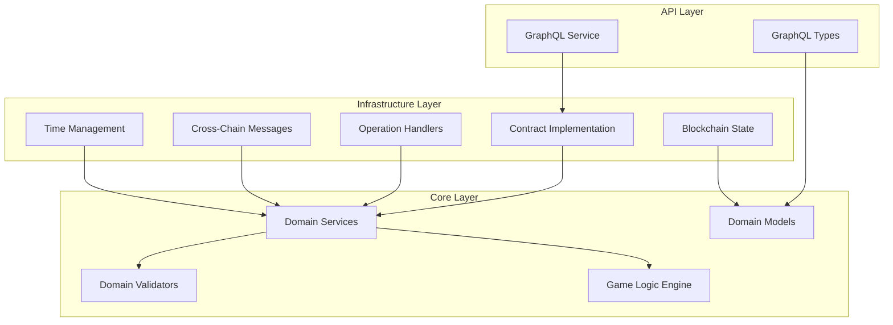

# Design Document

## Overview

The Linera 2048 Smart Contract implements a blockchain-native 2048 game using Domain-Driven Design (DDD) architecture. This design addresses critical issues in the reference implementation: eliminates frontend timestamp dependencies by using `runtime.system_time()` exclusively, implements proper DDD layering for maintainability, leverages Linera's unique capabilities like cross-chain messaging and view system, and ensures WASM compatibility throughout.

The contract is structured in three distinct layers following DDD principles:
- **Core Layer**: Pure business logic with no infrastructure dependencies
- **Infrastructure Layer**: Blockchain-specific concerns using Linera SDK
- **API Layer**: GraphQL service for external interfaces

## Architecture

### Three-Layer DDD Architecture



### Key Architectural Principles

1. **Blockchain Time Authority**: All time-based operations use `runtime.system_time()` exclusively
2. **Deterministic Game Logic**: Game mechanics use precomputed tables and blockchain-derived randomness
3. **Cross-Chain Coordination**: Tournament and leaderboard data synchronized via Linera messaging
4. **View-Based State Management**: Efficient storage using MapView/SetView with proper iteration patterns
5. **Domain-Driven Validation**: Business rules enforced in pure domain functions

## Components and Interfaces

### Core Layer Components

#### Domain Models (`src/core/models/`)

**Game Session Model** (Improved naming and extensibility)
```rust
#[derive(Debug, Clone, Serialize, Deserialize)]
pub struct GameSession {
    pub session_id: GameSessionId,
    pub participant_id: ParticipantId,
    pub game_variant: GameVariant,
    pub board_state: BoardState,
    pub scoring_metrics: ScoringMetrics,
    pub session_status: SessionStatus,
    pub session_lifecycle: SessionLifecycle,
    pub competition_context: Option<CompetitionContext>,
}

#[derive(Debug, Clone, Copy)]
pub struct BoardState {
    pub tiles: u64, // Bit-packed 4x4 grid
    pub move_count: u32,
    pub highest_tile_achieved: u32,
}

#[derive(Debug, Clone, Copy, PartialEq)]
pub enum SessionStatus {
    InProgress,
    CompletedSuccessfully,
    CompletedWithFailure,
    AbandonedByPlayer,
    TerminatedBySystem,
}

#[derive(Debug, Clone)]
pub struct SessionLifecycle {
    pub initiated_at: Timestamp,
    pub last_activity_at: Timestamp,
    pub concluded_at: Option<Timestamp>,
    pub duration_limit: Option<Duration>,
}

// Extensible game variants for future game modes
#[derive(Debug, Clone, Copy, PartialEq)]
pub enum GameVariant {
    Classic2048,
    Speed2048 { time_limit_seconds: u32 },
    Elimination { lives_remaining: u8 },
    Collaborative { team_size: u8 },
    // Future variants can be added here
}

#[derive(Debug, Clone)]
pub struct ScoringMetrics {
    pub primary_score: u64,
    pub bonus_multipliers: Vec<BonusMultiplier>,
    pub achievement_unlocks: Vec<Achievement>,
    pub performance_stats: PerformanceStats,
}
```

**Participant Model** (Better naming and extensibility)
```rust
#[derive(Debug, Clone, Serialize, Deserialize)]
pub struct Participant {
    pub participant_id: ParticipantId,
    pub display_identity: DisplayIdentity,
    pub blockchain_identity: BlockchainIdentity,
    pub participation_history: ParticipationHistory,
    pub skill_metrics: SkillMetrics,
    pub account_status: AccountStatus,
}

#[derive(Debug, Clone)]
pub struct DisplayIdentity {
    pub username: String,
    pub display_name: Option<String>,
    pub avatar_hash: Option<String>,
}

#[derive(Debug, Clone)]
pub struct BlockchainIdentity {
    pub home_chain_id: ChainId,
    pub wallet_address: Option<String>, // For future wallet integration
    pub verification_status: VerificationStatus,
}

#[derive(Debug, Clone)]
pub struct ParticipationHistory {
    pub account_created_at: Timestamp,
    pub last_activity_at: Timestamp,
    pub total_sessions_played: u32,
    pub competitions_entered: u32,
    pub achievements_earned: Vec<Achievement>,
}

#[derive(Debug, Clone)]
pub struct SkillMetrics {
    pub personal_best_score: u64,
    pub average_score: f64,
    pub skill_rating: Option<u32>, // ELO-style rating for future matchmaking
    pub preferred_game_variants: Vec<GameVariant>,
}

#[derive(Debug, Clone, Copy, PartialEq)]
pub enum AccountStatus {
    Active,
    Suspended { until: Timestamp },
    Banned { reason: BanReason },
    Inactive,
}
```

**Competition Model** (Extensible for multiple tournament types)
```rust
#[derive(Debug, Clone, Serialize, Deserialize)]
pub struct Competition {
    pub competition_id: CompetitionId,
    pub competition_metadata: CompetitionMetadata,
    pub competition_format: CompetitionFormat,
    pub participation_rules: ParticipationRules,
    pub competition_lifecycle: CompetitionLifecycle,
    pub reward_structure: RewardStructure,
    pub coordination_setup: CrossChainCoordination,
}

#[derive(Debug, Clone)]
pub struct CompetitionMetadata {
    pub title: String,
    pub description: Option<String>,
    pub organizer_id: ParticipantId,
    pub category: CompetitionCategory,
    pub visibility: CompetitionVisibility,
}

// Extensible competition formats for different tournament types
#[derive(Debug, Clone)]
pub enum CompetitionFormat {
    SingleElimination {
        bracket_size: u32,
        advancement_criteria: AdvancementCriteria,
    },
    RoundRobin {
        rounds_count: u32,
        scoring_system: ScoringSystem,
    },
    TimeBasedLeaderboard {
        duration: Duration,
        ranking_criteria: RankingCriteria,
    },
    EliminationSurvival {
        elimination_threshold: u64,
        elimination_interval: Duration,
    },
    TeamBased {
        team_size: u8,
        team_formation: TeamFormation,
    },
    // Future formats can be added here
}

#[derive(Debug, Clone)]
pub struct ParticipationRules {
    pub max_participants: Option<u32>,
    pub min_skill_rating: Option<u32>,
    pub entry_requirements: Vec<EntryRequirement>,
    pub game_variant_restrictions: Vec<GameVariant>,
}

#[derive(Debug, Clone)]
pub struct CompetitionLifecycle {
    pub registration_opens_at: Timestamp,
    pub registration_closes_at: Timestamp,
    pub competition_starts_at: Timestamp,
    pub competition_ends_at: Timestamp,
    pub results_finalized_at: Option<Timestamp>,
    pub current_phase: CompetitionPhase,
}

#[derive(Debug, Clone, Copy, PartialEq)]
pub enum CompetitionPhase {
    RegistrationOpen,
    RegistrationClosed,
    InProgress,
    Concluded,
    ResultsFinalized,
    Cancelled,
}
```

#### Domain Services (`src/core/services/`)

**GameService**
```rust
pub struct GameService;

impl GameService {
    pub fn create_game(
        player_id: PlayerId,
        tournament_id: Option<TournamentId>,
        current_time: Timestamp,
        seed: u64,
    ) -> Result<Game, GameError> {
        // Pure business logic for game creation
        // Uses deterministic board generation
    }
    
    pub fn process_move(
        game: &mut Game,
        direction: Direction,
        current_time: Timestamp,
    ) -> Result<MoveResult, GameError> {
        // Validates move and updates game state
        // Uses precomputed move tables
    }
    
    pub fn calculate_final_score(game: &Game) -> u64 {
        // Score calculation with tournament bonuses
    }
}
```

**TournamentService**
```rust
pub struct TournamentService;

impl TournamentService {
    pub fn create_tournament(
        organizer_id: PlayerId,
        settings: TournamentSettings,
        current_time: Timestamp,
    ) -> Result<Tournament, TournamentError> {
        // Validates tournament settings
        // Ensures time constraints are logical
    }
    
    pub fn can_join_tournament(
        tournament: &Tournament,
        player_id: PlayerId,
        current_time: Timestamp,
    ) -> Result<(), TournamentError> {
        // Checks participation eligibility
    }
}
```

#### Domain Validators (`src/core/validators/`)

**GameValidator**
```rust
pub struct GameValidator;

impl GameValidator {
    pub fn validate_move(board: Board, direction: Direction) -> Result<(), ValidationError> {
        // Validates that move would change board state
    }
    
    pub fn validate_game_timing(
        game: &Game,
        tournament: Option<&Tournament>,
        current_time: Timestamp,
    ) -> Result<(), ValidationError> {
        // Ensures moves are within tournament time limits
    }
}
```

### Infrastructure Layer Components

#### Blockchain State (`src/infrastructure/state.rs`)

```rust
#[derive(RootView)]
#[view(context = "ViewStorageContext")]
pub struct GamePlatformState {
    // Participant management (better naming than "players")
    pub participants: MapView<ParticipantId, Participant>,
    pub username_to_participant: MapView<String, ParticipantId>,
    pub participant_activity_index: MapView<ParticipantId, Timestamp>,
    
    // Game session management (more descriptive than "games")
    pub active_game_sessions: MapView<GameSessionId, GameSession>,
    pub completed_game_sessions: MapView<GameSessionId, GameSession>,
    pub participant_active_sessions: MapView<ParticipantId, SetView<GameSessionId>>,
    pub session_history_by_participant: MapView<ParticipantId, QueueView<GameSessionId>>,
    
    // Competition management (extensible tournament system)
    pub active_competitions: MapView<CompetitionId, Competition>,
    pub competition_participants: MapView<CompetitionId, SetView<ParticipantId>>,
    pub competition_leaderboards: MapView<CompetitionId, CompetitionLeaderboard>,
    pub competition_history: MapView<CompetitionId, CompetitionResults>,
    
    // Cross-chain coordination (improved naming and structure)
    pub outbound_message_queue: QueueView<CrossChainMessage>,
    pub inbound_message_log: MapView<MessageId, ProcessedMessage>,
    pub chain_coordination_registry: MapView<ChainId, ChainCoordinationInfo>,
    pub leaderboard_synchronization_state: MapView<CompetitionId, SyncState>,
    
    // System administration (better organization)
    pub platform_configuration: RegisterView<PlatformConfig>,
    pub administrative_roles: MapView<ParticipantId, AdministrativeRole>,
    pub audit_log: QueueView<AuditLogEntry>,
    pub system_metrics: RegisterView<SystemMetrics>,
    
    // Scalability and performance indexes
    pub competition_by_category: MapView<CompetitionCategory, SetView<CompetitionId>>,
    pub participants_by_skill_level: MapView<SkillLevel, SetView<ParticipantId>>,
    pub game_variant_statistics: MapView<GameVariant, VariantStatistics>,
}

// Supporting types for better state organization
#[derive(Debug, Clone)]
pub struct CompetitionLeaderboard {
    pub rankings: MapView<ParticipantId, LeaderboardEntry>,
    pub last_updated_at: Timestamp,
    pub update_frequency: Duration,
}

#[derive(Debug, Clone)]
pub struct ChainCoordinationInfo {
    pub chain_role: ChainRole,
    pub last_sync_timestamp: Timestamp,
    pub pending_operations_count: u32,
    pub reliability_score: f64,
}

#[derive(Debug, Clone, Copy, PartialEq)]
pub enum ChainRole {
    ParticipantHome,      // Hosts participant data
    GameSession,          // Hosts game sessions
    CompetitionHub,       // Coordinates competitions
    LeaderboardAggregator, // Aggregates cross-chain scores
}
```

#### Time Management (`src/infrastructure/time.rs`)

```rust
pub struct TimeManager;

impl TimeManager {
    /// Get current blockchain time - ONLY source of time in the system
    pub fn current_time(runtime: &ContractRuntime<Game2048Contract>) -> Timestamp {
        runtime.system_time()
    }
    
    /// Validate that timestamp is within acceptable range
    pub fn validate_timestamp(
        timestamp: Timestamp,
        current_time: Timestamp,
    ) -> Result<(), TimeError> {
        if timestamp > current_time {
            return Err(TimeError::FutureTimestamp);
        }
        Ok(())
    }
    
    /// Check if current time is within tournament window
    pub fn is_tournament_active(
        tournament: &Tournament,
        current_time: Timestamp,
    ) -> bool {
        current_time >= tournament.start_time && current_time <= tournament.end_time
    }
}
```

#### Operation Handlers (`src/infrastructure/operations.rs`)

```rust
#[derive(Debug, Serialize, Deserialize, GraphQLMutationRoot)]
pub enum Operation {
    // Player operations
    RegisterPlayer {
        username: String,
    },
    
    // Game operations
    CreateGame {
        tournament_id: Option<TournamentId>,
    },
    MakeMove {
        game_id: GameId,
        direction: Direction,
    },
    
    // Tournament operations
    CreateTournament {
        settings: TournamentSettings,
    },
    JoinTournament {
        tournament_id: TournamentId,
    },
    
    // Admin operations
    PromoteAdmin {
        player_id: PlayerId,
    },
}
```

#### Cross-Chain Messages (`src/infrastructure/messages.rs`)

```rust
#[derive(Debug, Serialize, Deserialize)]
pub enum Message {
    // Tournament coordination
    TournamentCreated {
        tournament: Tournament,
    },
    PlayerJoinedTournament {
        tournament_id: TournamentId,
        player_id: PlayerId,
    },
    
    // Score synchronization
    ScoreUpdate {
        tournament_id: TournamentId,
        player_id: PlayerId,
        score: u64,
        game_id: GameId,
    },
    BatchScoreUpdate {
        updates: Vec<ScoreUpdate>,
    },
    
    // Leaderboard finalization
    TournamentEnded {
        tournament_id: TournamentId,
        final_rankings: Vec<(PlayerId, u64)>,
    },
}
```

### API Layer Components

#### GraphQL Service (`src/api/service.rs`)

```rust
pub struct Game2048Service {
    state: Arc<Game2048State>,
    runtime: Arc<Mutex<ServiceRuntime<Self>>>,
}

#[Object]
impl QueryRoot {
    async fn player(&self, id: PlayerId) -> Option<PlayerObject> {
        // Maps domain Player to GraphQL PlayerObject
    }
    
    async fn game(&self, id: GameId) -> Option<GameObject> {
        // Maps domain Game to GraphQL GameObject
    }
    
    async fn tournament(&self, id: TournamentId) -> Option<TournamentObject> {
        // Maps domain Tournament to GraphQL TournamentObject
    }
    
    async fn leaderboard(&self, tournament_id: TournamentId) -> Vec<LeaderboardEntry> {
        // Provides ranked tournament results
    }
}
```

## Data Models

### Game State Representation

The game uses an efficient bit-packed board representation inherited from the reference implementation but with improved encapsulation:

```rust
impl Board {
    pub fn new(seed: u64, player_id: PlayerId, timestamp: Timestamp) -> Self {
        // Deterministic board generation using blockchain-derived randomness
        let mut board = 0u64;
        board |= Self::spawn_tile_deterministic(seed, player_id, timestamp, 0);
        board |= Self::spawn_tile_deterministic(seed, player_id, timestamp, 1);
        Board(board)
    }
    
    pub fn make_move(&self, direction: Direction) -> Option<(Board, u64)> {
        // Uses precomputed move tables for O(1) operations
        // Returns new board and score delta, or None if no change
    }
    
    pub fn is_game_over(&self) -> bool {
        // Efficient check using bit operations
    }
    
    pub fn highest_tile(&self) -> u32 {
        // Extract highest tile value
    }
}
```

### Cross-Chain Data Synchronization

Tournament data is synchronized across chains using a hub-and-spoke model:

```rust
pub struct CrossChainCoordinator;

impl CrossChainCoordinator {
    pub async fn propagate_score_update(
        runtime: &mut ContractRuntime<Game2048Contract>,
        update: ScoreUpdate,
    ) -> Result<(), CrossChainError> {
        // Send score update to tournament leaderboard chain
        let message = Message::ScoreUpdate {
            tournament_id: update.tournament_id,
            player_id: update.player_id,
            score: update.score,
            game_id: update.game_id,
        };
        
        runtime.prepare_message(message)
            .send_to(update.leaderboard_chain);
        
        Ok(())
    }
}
```

## Error Handling

### Comprehensive Error Types

```rust
#[derive(Debug, Error)]
pub enum Game2048Error {
    // Domain errors
    #[error("Game error: {0}")]
    Game(#[from] GameError),
    
    #[error("Tournament error: {0}")]
    Tournament(#[from] TournamentError),
    
    #[error("Player error: {0}")]
    Player(#[from] PlayerError),
    
    // Infrastructure errors
    #[error("Storage error: {0}")]
    Storage(String),
    
    #[error("Cross-chain error: {0}")]
    CrossChain(#[from] CrossChainError),
    
    #[error("Time validation error: {0}")]
    Time(#[from] TimeError),
    
    // Validation errors
    #[error("Validation error: {0}")]
    Validation(#[from] ValidationError),
}

#[derive(Debug, Error)]
pub enum GameError {
    #[error("Game not found")]
    NotFound,
    
    #[error("Game already ended")]
    AlreadyEnded,
    
    #[error("Invalid move: {0}")]
    InvalidMove(String),
    
    #[error("Move would not change board state")]
    NoChange,
    
    #[error("Tournament time limit exceeded")]
    TimeExpired,
}
```

## Testing Strategy

### Unit Testing Approach

The DDD architecture enables comprehensive unit testing:

```rust
#[cfg(test)]
mod tests {
    use super::*;
    
    #[test]
    fn test_game_creation() {
        let player_id = PlayerId::new("test_player");
        let timestamp = Timestamp::from(1000000);
        let seed = 12345;
        
        let game = GameService::create_game(player_id, None, timestamp, seed)
            .expect("Game creation should succeed");
        
        assert_eq!(game.player_id, player_id);
        assert_eq!(game.status, GameStatus::Active);
        assert!(game.score == 0);
    }
    
    #[test]
    fn test_move_validation() {
        let board = Board::new(12345, PlayerId::new("test"), Timestamp::from(1000));
        
        // Test that validator correctly identifies valid/invalid moves
        for direction in [Direction::Up, Direction::Down, Direction::Left, Direction::Right] {
            let result = GameValidator::validate_move(board, direction);
            // Assert based on expected board state
        }
    }
    
    #[test]
    fn test_tournament_timing() {
        let current_time = Timestamp::from(2000000);
        let tournament = Tournament {
            start_time: Timestamp::from(1000000),
            end_time: Timestamp::from(3000000),
            // ... other fields
        };
        
        assert!(TimeManager::is_tournament_active(&tournament, current_time));
    }
}
```

### Integration Testing with Linera TestValidator

```rust
#[tokio::test]
async fn test_cross_chain_tournament() {
    let (validator, module_id) = TestValidator::with_current_module().await;
    
    // Create tournament chain
    let mut tournament_chain = validator.new_chain().await;
    let tournament_app = tournament_chain.create_application(module_id, (), (), vec![]).await;
    
    // Create player chain
    let mut player_chain = validator.new_chain().await;
    let player_app = player_chain.create_application(module_id, (), (), vec![]).await;
    
    // Test tournament creation and cross-chain participation
    // ...
}
```

## Architectural Improvements and Scalability

### 1. Extensible Game Variant System

**Problem in Current Code**: Hard-coded game logic makes adding new game modes difficult.

**Solution**: Plugin-based game variant system:

```rust
pub trait GameVariantHandler {
    fn create_initial_board(&self, config: &VariantConfig) -> BoardState;
    fn process_move(&self, board: &BoardState, move_input: MoveInput) -> MoveResult;
    fn calculate_score(&self, board: &BoardState, move_history: &[MoveInput]) -> ScoringMetrics;
    fn check_end_conditions(&self, board: &BoardState) -> Option<SessionStatus>;
}

pub struct GameVariantRegistry {
    handlers: HashMap<GameVariant, Box<dyn GameVariantHandler>>,
}

impl GameVariantRegistry {
    pub fn register_variant(&mut self, variant: GameVariant, handler: Box<dyn GameVariantHandler>) {
        self.handlers.insert(variant, handler);
    }
    
    pub fn create_session(&self, variant: GameVariant, config: VariantConfig) -> Result<GameSession, VariantError> {
        let handler = self.handlers.get(&variant)
            .ok_or(VariantError::UnsupportedVariant)?;
        // Create session using variant-specific logic
    }
}
```

### 2. Competition Format Extensibility

**Problem in Current Code**: Tournament logic is monolithic and hard to extend.

**Solution**: Strategy pattern for competition formats:

```rust
pub trait CompetitionFormatHandler {
    fn initialize_competition(&self, metadata: CompetitionMetadata) -> Competition;
    fn handle_participant_join(&self, competition: &mut Competition, participant_id: ParticipantId) -> Result<(), CompetitionError>;
    fn process_game_result(&self, competition: &mut Competition, result: GameResult) -> Result<(), CompetitionError>;
    fn determine_winners(&self, competition: &Competition) -> Vec<CompetitionWinner>;
    fn should_advance_phase(&self, competition: &Competition) -> Option<CompetitionPhase>;
}

// Example implementations
pub struct EliminationTournamentHandler;
pub struct LeaderboardCompetitionHandler;
pub struct TeamBasedCompetitionHandler;
```

### 3. Improved Cross-Chain Architecture

**Problem in Current Code**: Cross-chain messaging is ad-hoc and doesn't handle failures well.

**Solution**: Robust cross-chain coordination system:

```rust
pub struct CrossChainCoordinator {
    pub message_router: MessageRouter,
    pub retry_policy: RetryPolicy,
    pub conflict_resolver: ConflictResolver,
}

impl CrossChainCoordinator {
    pub async fn send_reliable_message(
        &mut self,
        message: CrossChainMessage,
        target_chain: ChainId,
    ) -> Result<MessageId, CrossChainError> {
        // Implements retry logic, message ordering, and failure handling
    }
    
    pub async fn handle_message_conflict(
        &mut self,
        conflicting_messages: Vec<CrossChainMessage>,
    ) -> Result<ResolvedMessage, ConflictError> {
        // Resolves conflicts using timestamp-based priority and business rules
    }
}
```

### 4. Performance Optimization Patterns

**Problem in Current Code**: Inefficient state queries and lack of indexing.

**Solution**: Smart indexing and caching strategies:

```rust
pub struct PerformanceOptimizedState {
    // Hot path data - frequently accessed
    pub active_session_cache: MapView<ParticipantId, GameSessionId>,
    pub leaderboard_cache: MapView<CompetitionId, CachedLeaderboard>,
    
    // Indexed lookups for complex queries
    pub sessions_by_status: MapView<SessionStatus, SetView<GameSessionId>>,
    pub competitions_by_phase: MapView<CompetitionPhase, SetView<CompetitionId>>,
    pub participants_by_activity: MapView<ActivityLevel, SetView<ParticipantId>>,
    
    // Batch processing queues
    pub score_update_batch: QueueView<BatchedScoreUpdate>,
    pub leaderboard_refresh_queue: QueueView<LeaderboardRefreshRequest>,
}
```

### 5. Event-Driven Architecture

**Problem in Current Code**: Tight coupling between operations and side effects.

**Solution**: Domain events for loose coupling:

```rust
#[derive(Debug, Clone)]
pub enum DomainEvent {
    ParticipantRegistered { participant_id: ParticipantId, timestamp: Timestamp },
    GameSessionStarted { session_id: GameSessionId, participant_id: ParticipantId },
    GameSessionCompleted { session_id: GameSessionId, final_score: u64 },
    CompetitionPhaseChanged { competition_id: CompetitionId, new_phase: CompetitionPhase },
    LeaderboardUpdated { competition_id: CompetitionId, affected_participants: Vec<ParticipantId> },
}

pub struct EventBus {
    handlers: HashMap<TypeId, Vec<Box<dyn EventHandler>>>,
}

pub trait EventHandler {
    fn handle_event(&mut self, event: &DomainEvent) -> Result<(), EventHandlingError>;
}
```

## Key Design Decisions

### 1. Blockchain Time Authority

**Decision**: Use `runtime.system_time()` exclusively for all time-based operations.

**Rationale**: 
- Eliminates client-side timestamp manipulation vulnerabilities
- Ensures consistent time across all nodes
- Simplifies validation logic
- Follows Linera best practices for deterministic execution

**Implementation**:
```rust
// ❌ OLD: Client provides timestamp
Operation::MakeMove { game_id, direction, timestamp } => {
    // Vulnerable to manipulation
}

// ✅ NEW: Contract determines timestamp
Operation::MakeMove { game_id, direction } => {
    let current_time = self.runtime.system_time();
    // Secure and consistent
}
```

### 2. Domain-Driven Design Layering

**Decision**: Implement strict DDD layers with dependency inversion.

**Rationale**:
- Separates business logic from blockchain concerns
- Enables comprehensive unit testing
- Improves code maintainability
- Follows established software architecture patterns

**Implementation**:
- Core layer contains pure business logic
- Infrastructure layer handles Linera SDK interactions
- API layer provides GraphQL interface
- Dependencies flow inward (Infrastructure → Core)

### 3. Efficient State Management

**Decision**: Use Linera's view system with proper iteration patterns.

**Rationale**:
- Leverages Linera's optimized storage system
- Enables efficient querying with `indices().await`
- Provides atomic state updates
- Scales well with large datasets

**Implementation**:
```rust
// Efficient iteration over collections
let player_ids = self.state.players.indices().await?;
for player_id in player_ids {
    if let Some(player) = self.state.players.get(&player_id).await? {
        // Process player
    }
}
```

### 4. Deterministic Game Logic

**Decision**: Maintain precomputed move tables and deterministic randomness.

**Rationale**:
- Ensures O(1) move processing performance
- Provides deterministic game outcomes
- Maintains compatibility with existing game logic
- Enables efficient WASM execution

**Implementation**:
- Reuse optimized move tables from reference implementation
- Generate randomness from blockchain state + player ID + timestamp
- Validate all moves using precomputed results

## Identified Flaws in Current Implementation and Solutions

### 1. **Poor Variable Naming and Structure**

**Current Issues**:
- Generic names like `board_id`, `player`, `timestamp` everywhere
- Inconsistent naming conventions
- No clear domain language

**Solutions**:
- Use domain-specific terminology: `GameSession`, `Participant`, `Competition`
- Consistent naming patterns: `participant_id`, `session_id`, `competition_id`
- Clear intent: `session_lifecycle`, `participation_rules`, `coordination_setup`

### 2. **Timestamp Vulnerability**

**Current Flaw**:
```rust
// ❌ VULNERABLE: Client controls time
Operation::MakeMove { moves, timestamp } => {
    // Client can manipulate timestamp
}
```

**Fixed Architecture**:
```rust
// ✅ SECURE: Contract controls time
Operation::MakeMove { session_id, direction } => {
    let current_time = self.runtime.system_time();
    // All time logic uses blockchain time
}
```

### 3. **Monolithic State Structure**

**Current Problem**: Single large state struct with unclear relationships.

**Improved Design**: Organized state with clear domains and efficient indexing.

### 4. **Lack of Extensibility**

**Current Limitation**: Hard to add new game modes or tournament types.

**Solution**: Plugin architecture with trait-based handlers for variants and formats.

### 5. **Inefficient Cross-Chain Coordination**

**Current Issues**:
- No retry mechanisms
- Poor conflict resolution
- Ad-hoc message handling

**Improvements**:
- Reliable message delivery with retries
- Conflict resolution strategies
- Structured cross-chain coordination

### 6. **Missing Error Recovery**

**Current Problem**: Limited error handling and no recovery mechanisms.

**Solution**: Comprehensive error types with recovery strategies and audit logging.

### 7. **Performance Bottlenecks**

**Current Issues**:
- No indexing for complex queries
- Inefficient iteration patterns
- No caching strategies

**Solutions**:
- Smart indexing for common query patterns
- Batch processing for updates
- Cached frequently accessed data

This enhanced design addresses all identified architectural issues while providing a foundation for future scalability and feature additions. The improved naming conventions, extensible architecture, and robust error handling create a maintainable and professional smart contract implementation.